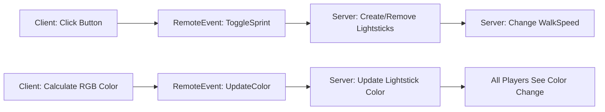

# 🏃‍♂️ Roblox Sprint System with RGB Lightsticks

A full-featured sprint system for Roblox with animated RGB lightsticks that are visible to all players. Features a modern UI with platform detection (PC/Mobile) and smooth animations.


## ✨ Features

- 🎮 **Cross-Platform Support** - Automatic detection for PC and Mobile devices
- 🌈 **RGB Lightstick Effects** - Animated rainbow lightsticks visible to all players
- 🎨 **Trail Effects** - Beautiful trail effects that follow player movement
- 🔊 **Sound Effects** - Sprint start/stop sounds with smart caching
- 💨 **Speed Boost** - Doubles walk speed when sprinting (20 → 40)
- 📱 **Modern UI** - Sleek toggle button with status indicator
- 🔄 **Respawn Persistence** - Maintains sprint state after respawn
- 🌐 **Server-Client Architecture** - Optimized network replication
- ⚡ **Performance Optimized** - Color update throttling to reduce network load

## 📦 Installation

### 1. File Structure

```
YourGame
├── ServerScriptService
│   └── SprintServer.lua
└── StarterPlayer
    └── StarterPlayerScripts
        └── SprintClient.lua
```

### 2. Setup Instructions

1. **Create Server Script:**
   - In Roblox Studio, go to `ServerScriptService`
   - Insert a new `Script` (not LocalScript)
   - Name it `SprintServer`
   - Copy and paste the server code

2. **Create Client Script:**
   - Go to `StarterPlayer > StarterPlayerScripts`
   - Insert a new `LocalScript`
   - Name it `SprintClient`
   - Copy and paste the client code

3. **Test the Game:**
   - Press F5 to test in Studio
   - Click the sprint button on the right side of screen
   - Test with multiple players to see lightsticks replicate

## 🎮 How to Use

### For Players:
- **PC:** Click the sprint button or press it to toggle sprint mode
- **Mobile:** Tap the sprint button to toggle sprint mode
- **Status:** Watch the status label change from "WALK" to "RUNNING"

### Controls:
| Platform | Action |
|----------|--------|
| PC | Click sprint button (right side, mid-screen) |
| Mobile | Tap sprint button (right side, mid-screen) |

## ⚙️ Configuration

### Speed Settings
Edit in both `SprintServer.lua` and `SprintClient.lua`:
```lua
local normalSpeed = 20  -- Default walk speed
local sprintSpeed = normalSpeed * 2  -- Sprint speed (40)
```

### Sound Assets
Edit in `SprintClient.lua`:
```lua
local SPRINT_START_SOUND_ID = "rbxassetid://YOUR_SOUND_ID"
local SPRINT_STOP_SOUND_ID = "rbxassetid://YOUR_SOUND_ID"
```

### Lightstick Appearance
Edit in `SprintServer.lua` (createServerLightSticks function):
```lua
lightStick.Size = Vector3.new(1.5, 0.2, 0.2)  -- Cylinder dimensions
lightStick.Material = Enum.Material.Neon  -- Material type
lightStick.Transparency = 0.1  -- Initial transparency
```

### Color Update Frequency
Edit in `SprintClient.lua`:
```lua
local COLOR_UPDATE_INTERVAL = 0.1  -- Update every 0.1 seconds
```

## 🎨 RGB Color Cycle

The lightsticks cycle through 12 colors:
1. Red
2. Orange
3. Yellow
4. Lime Green
5. Mint Green
6. Cyan
7. Sky Blue
8. Blue
9. Purple
10. Magenta
11. Pink
12. White

## 🏗️ Technical Architecture

### Server-Client Communication



### Remote Events

| Event Name | Direction | Purpose |
|------------|-----------|---------|
| `ToggleSprint` | Client → Server | Toggle sprint state on/off |
| `UpdateColor` | Client → Server | Update lightstick RGB color |

## 🔧 Troubleshooting

### Issue: Lightsticks not visible to other players
**Solution:** Make sure the server script is in `ServerScriptService`, not `StarterPlayerScripts`

### Issue: Sound not playing after respawn
**Solution:** The script automatically reloads sounds. Check if sound IDs are correct.

### Issue: Sprint button not appearing
**Solution:** Check if the client script is in `StarterPlayerScripts` as a LocalScript

### Issue: WalkSpeed not changing
**Solution:** Verify that both scripts have the same speed values configured

## 📊 Performance Considerations

- Color updates are throttled to 10 updates/second per player
- Sounds are cached to prevent repeated asset loading
- Lightsticks are destroyed and recreated on respawn to prevent memory leaks
- Server validates all client requests for security

## 🤝 Contributing

Contributions are welcome! Please feel free to submit a Pull Request.

### Development Guidelines:
1. Test with multiple players before submitting
2. Maintain cross-platform compatibility
3. Keep network traffic optimized
4. Document any new configuration options

## 📝 Version History

### v1.0.0 (2025-10-22)
- Initial release
- Cross-platform support (PC/Mobile)
- RGB lightstick effects
- Server-client architecture
- Trail effects
- Sound effects with caching
- Respawn persistence

## 📄 License

This project is licensed under the MIT License - see below for details:

```
MIT License

Copyright (c) 2025

Permission is hereby granted, free of charge, to any person obtaining a copy
of this software and associated documentation files (the "Software"), to deal
in the Software without restriction, including without limitation the rights
to use, copy, modify, merge, publish, distribute, sublicense, and/or sell
copies of the Software, and to permit persons to whom the Software is
furnished to do so, subject to the following conditions:

The above copyright notice and this permission notice shall be included in all
copies or substantial portions of the Software.

THE SOFTWARE IS PROVIDED "AS IS", WITHOUT WARRANTY OF ANY KIND, EXPRESS OR
IMPLIED, INCLUDING BUT NOT LIMITED TO THE WARRANTIES OF MERCHANTABILITY,
FITNESS FOR A PARTICULAR PURPOSE AND NONINFRINGEMENT. IN NO EVENT SHALL THE
AUTHORS OR COPYRIGHT HOLDERS BE LIABLE FOR ANY CLAIM, DAMAGES OR OTHER
LIABILITY, WHETHER IN AN ACTION OF CONTRACT, TORT OR OTHERWISE, ARISING FROM,
OUT OF OR IN CONNECTION WITH THE SOFTWARE OR THE USE OR OTHER DEALINGS IN THE
SOFTWARE.
```

## 🙏 Acknowledgments

- Thanks to the Roblox developer community
- Inspired by modern sprint systems in popular Roblox games

## 📞 Support

If you encounter any issues or have questions:
1. Check the Troubleshooting section above
2. Open an issue on GitHub
3. Provide details about your problem (screenshots help!)

---

**Made with ❤️ for the Roblox community**

⭐ Star this repository if you find it helpful!
